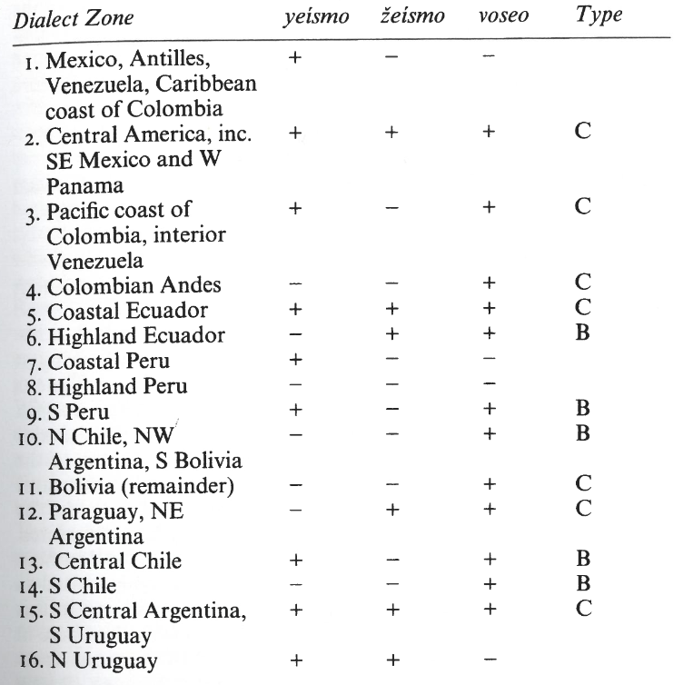

# Listing Linguistic Phenomena of Variation in Spanish 

The following list is based on Lipski (1994) "Latin American Spanish"

## Attempts to classify the different dialects of Spanish

### Five zone classification (Henríquez Ureña) for Latin America

1. Mexico, New Mexico & most of Central America {Nahuatl}
2. The Caribbean (Antilles & coastal regions of Colombia & Venezuela) {Carib/Arawak}
3. from Colombia to Bolivia & Northern Chile {Quechua}
4. Central & Southern Chile {Mapuche/Araucano}
5. Argentinia, Uruguay & Paraguay {Guaraní}

Main criterion were lexical items!

Critique: Language within the zones is vastly diverse

### Highland, lowland / coastal separation

Phonetic similarity in coastal areas

### Categorization by Rona

1. *zeísmo* (phonetic)
2. *yeísmo* (phonetic)
3. presence or absence of *voseo*
4. verbal morphology which is used together with *vos* if *voseo* is used

*voseo* ==> use of *vos* as the second person singular pronoun instead of *tú*

#### *voseo* types

| Type | -ar  | -er  | ir  |
|------|------|------|-----|
| A    | -áis | -éis | -ís |
| B    | -áis | -ís  | -ís |
| C    | -ás  | -és  | -ís |
| D    | -as  | -es  | -is |

In reality, there are more versions of *voseo*.

The use of *voseo* is tied to social factors.

### Categorization by Zamora and Guitart

1. velar vs. pharyngeal articulation of /x/
2. sibilant vs. reduced /s/ in syllable-final position
3. presence of absence of *vos* as subject pronoun (consider also the coexistence of *tú* and *vos*)

### Categorization by relative chronology of settlement

Areas which had a strong commercial and political relationship show "old" characteristics of Spanish while areas that were "shunted away from principal trade routes" exhibit more "modern" traits.

## Important factors for Diversity in Spanish

- bilingualism (e.g. indigenous & Spanish)
- influences from
    - indigenous languages
    - African languages
    - Creole / Pidgin (?) languages
- importance of a region during period of colonialism

## Characteristics of Argentinian Spanish

The prototype for Argentine Spanish is the prestigious so-called *porteño* speech of Buenos Aires.

Contemporary Argentina is considered a nation with minimal indigenous presence. Linguistic influences of indigenous languages are present mostly (only?) in the North and West. 

- *Guaraní* (Northeastern Argentina)
- *Quechua* (extreme Northwestern Argentina)

Considerable influence of African languages in Buenos Aires.

Considerable influence of Italian (due to Italian immigration begun in the late 1800)

### Morphological characteristics

- uniform use of *vos* instead of *tú*
- most of Argentina employs *lo* as the third person singular direct object clitic for masculine referents (in the Northeast the use of *le* is more common)
- in Jujuy, *lo* is sometimes used as a dative clitic

### Syntactic characteristics

- clitic doubling of definite personal direct object nouns
    - *lo conozco a Juan*
- generic use of *lo* even when no masculine singular reference is present (Quechua-influenced Northwest)
    - *lo quiere much a su hijita*
- verb tense usage can diverge from the prescriptive norms, e.g. use of simple preterite instead of present imperfect, even when connection to the present is established
    - interpreting *Juan no llegó* as *Juan has not arrived \[yet\]*
- breaking with the so-called "sequence of tenses", e.g. allowing a matrix verb in the past or conditional to freely combine with a subordinate verb in the preent subjunctive
    - *Juan me dijo que lo haga \[hiciera\] in seguida*
- in vernacular speech of many regions, *yo* replaces *a mí* in dative-verb constructions
    - *yo \[a mí\] me parece que me voy*
- *nos* appears preverbally in exhortative constructions (Northern Argentina)
    - *nos sentemos \[sentémonos\]*
- reflexive clitic *se* is used generically (even if no third person reference is present) by less educated speakers
    - *se \[nos\] llevamos bien*
- combinations in which a subject precedes a non-finite verb form e.g. gerund or infinitive, more in rural areas of Central Argentina
    - *al yo venir*

The following characteristics are also shared with Paraguayan Spanish.

- lack of copula combined with subject-final word order
    - *muy malo vos \[vos sos muy malo\]*
- redundant possessives with inalienable possession
    - *de mi cabeza sufro \[sufro de la cabeza\]*
- preposed (?) double negation
    - *nadie no está \[no hay nadie\]*
- absence of reflexive clitics in inalienable possession constructions
    - *poné tu pollera \[ponete la pollera\]*
- null direct object
    - *llevé los papeles para la farmacia y no sé si \[los\] perdí*
- postposed *eso* to include other members of a group
    - *mi mamá eso* (my mother and others)
- use of *grande*  instead of *mucho*
    - *comió grande* (he ate a lot)
- use of *ir en* to express motion
    - *el sé va en \[va a\] Corrientes*
- *mismo* is often used as an affirmative respones to a question (kinda like *same*)

## Characteristics of Bolivian Spanish

The highland dialects of Bolivia have been influenced by the two principal indigenous languages there:

- *Quechua* 
- *Aymara*

The Spanish in the eastern *laanos*, however, shares more similarities with Paraguyan Spanish.

There is evidence that there existed some Afro-Hispanic language in colonial Bolivia.

### Morphological characteristics

- use of *vos* and *tú*, most of Bolivia uses *vos* in some circumstances (depends geographically, sociolinguistically & ethnolinguistically)
    - in urban highland areas, monolingual speakers of Spanish use both *vos* (almost always combined with the verb conjugation associated with *tú*, e.g. *vos tienes*) and *tú*
    - … (check page 190)
- in the llanos, *-ingo* and *-inga* are used as diminiutive forms in popular speech (*-ongo* for augmentatives)
- throughout Bolivia, *che* is used as a vocative (as in Argentina and Paraguay)
- the suffix *-y* may be added to Spanish words in order to give them an affectionate tone (among Quechua speakers)
    - *herminatay* (dear sister)

### Syntactic characteristics

Syntactic diversions are almost entirely tied to interactions with the two principal indigenous languages

- direct object clitic doubling is very frequent and, among less fluent Spanish speakers, *lo* is the most frequently used clitic
    - *tú lo tienes la dirección*
- repetition of clitics in the pre- and postverbal position is common in vernacular speech
    - *te estoy hablándote yo de acá*
- direct objects can be unmarked by an overt clitic and preposed direct objects need not be doubled by clitics (?)
    - *Aquí están los medicamentos.* - *¿Cómo _ has traído?*
- the infix *-ri-* might be added to Spanish imperative by recessive Quechua speakers to invoke a nuance of polite request
    - *darime*
- the use of *en aquí*, *en allá* etc. is quite frequent (is this syntax?)
- many bilinguals use Spanish words as phrase-final particles, sometimes as calques of the indigenous language they speak
    - *¿Estas yendo y?*
- Aymara-speaking (and also some Quechua-speaking) Bolivians make use of *nomás*, *pues*, *pero* and *siempre* as phrase-final particles signalling degree of involvement, effect, etc. This is not exclusive to Bolivian Spanish, however, in Bolivian Spanish *nomás*, *pues* and *pero* can combine two and three at a time to convey subtle shades of meaning
    - *Dile nomás pues pero*
- *siempre* can have an additional meaning to "still, after all", in that it simply reinforces the sentence
    - *Aquí había estado siempre*
- the use of the gerund in vernacular highland Spanish diverges from the use in monolingual Spanish dialects (most commonly used verb is *diciendo*)
    - *diciendo me ha dicho* (he told me \[like this\])
- *dice* and *dizque* are used to report non-experienced events
    - *extrañaba a sus hijos, dice*
- use of the Spanish pluperfect even when there is no following event to talk about reported events
    - *había dejado el paquete en la cocina*
- use of double possessives, combination of the possessive article with a genitive phrase involving *de* (frequently preposed) (Andean region)
    - *de la María su casa*

## Characteristics of Chilean Spanish

Chilean Spanish shows very little regional variation and striking differences from neighbouring countries, which makes it fairly easy to distinguish.

The most influencial indigenous language in Chile is the *Mapuche* language. In northeastern Chile a small but stable coommunity of *Aymara* speakers exists.

### Morphological characteristics

- both *vos* and *tú* are used in Chile, it is, however, very dependent on the context (e.g. social status)
    - *tú* can be used with the verbal morphology of *vos*, but the same does not hold vice versa (# *vos tienes*)
    - second conjugation verbs in *-ís* were becoming more common among the middle class

## Characteristics of Colombian Spanish

Many African slaves were shipped to Colombia, which lead to a rather big African population there and thus to an influence on Spanish by the African languages. There is also an Afro-Colombian creole language *Palenquero*. Influence from indigenous populations is minimal in Colombia.

### Morphological characteristics

- *usted* is used as a familiar pronoun in many regions of Colombia
    - most of the country even rarely uses *tú* as a familiar pronoun, a combination of *usted* and *vos* is preferred
    - *tú*, however, is used almost exclusively on the Carribean coast
    - the verb forms accompanying *vos* are usually *-ás*, *-és* and *-ís* (in some dialects *-er* verbs also take the *-ís* ending)
- in some parts of the highlands, the pronoun *su mercé* / *su merced* is used
- gives preference to the diminiutive *-ico*, mostly to nouns and adjectives which end with a /t/ or a /d/ (shared with Cuba & Costa Rica)
- in the Quechua-influenced highland region, diminiutive endings may be attached to clitic pronouns, especially in imperative constructions
    - *bájemelito*
- in that same region mentioned above, imperative constructions are sometimes based on the future tense, clitics are attached to the end
    - *ayudarásle a tu hermano*

### Syntactic characteristics

- common use of the "intensive *ser*" (also found in Ecuador, Panama & Venezuela)
    - *lo hice fue en el verano*
- frequent use of preposed pronominal subjects of infinitives
    - *antes de yo salir de mi país*
- in the southern Andean region, verbal paraphrases with gerunds appear, e.g. combinations of *venir* + gerund but also others
    - *deles pasando el cafecito \[páseles\]*
    - *vine comiendo \[comí ante de venir\]*
- doubling of direct object clitics
    - *lo veo el caballo*
- along the Pacific coast, double negation is frequent
    - *no hablo inglés no*
- use of disjunctive subject pronouns for direct objects (might be transferred from vernacular Brazilian Portugese) (?)
    - *cuando él mira nosotro, eyos juega*
- in the Amazonian region, repeated use of redundant subject pronouns is common
    - *Eyos tan saltando y cuando eyos miran que …*
- in the Colombian Amazon, inanimate direct objects can be omitted
    - *ustede yevó carne, no me dio [0]*
- in the same region mentioned above the direct object can be doubled by clitics (often just *lo*)
    - *lo mató una danta*

## Characteristics of Costa Rican Spanish

Costa Rican Spanish is "radically different" from the two adjacent countries, Panama and Nicaragua.

Influence of indigenous languages on Costa Rican Spanish is minimal, creole English and West Indian English, however, are responsible for notable deviations in the local Spanish.

### Morphological characteristics

- use of the *voseo* and also *usted* even for friends and close family members
    - along the border with Panama, the *voseo* forms are of type A (diphtongized forms)
- preference of the diminutive *-ico* when the preceeding consonant is a /t/ or a /d/ or in order to reduplicate *-ito*
    - *momentico*, *hermanitico*
- in vernacular speech, collective nouns are often build by adding the suffix *-ada*
    - *güilada* (group of children) from *güila* (small child)
- use of the suffix *-era* to refer to the act of doing something, items related to a general activity or a general collective
    - *conversadera* (having a conversation), *comidera* (food, eating)

## Characteristics of Cuban Spanish

Cuban Spanish is noticeably influenced by English due to its close ties with the US. Further, African presence was and is considerable in Cuba which lead to influences of different creole languages as well as a widely spoken Africanized Spanish pidgin on the Cuban Spanish. Black workers from Curacao also introduced the Afro-Iberian creole Papiamento. Due to a large wave of immigration from China, there are linguistic traces of Chinese in Cuban Spanish.  

### Morphological characteristics

- Cuban Spanish uniformly uses *tú* for the familiar pronoun, often also extended to other first-time aquaintances
- like Costa Rican Spanish, Cuban Spanish prefers to use the diminutive *-ico* 
    - *momentico*, *chiquitico*
- suffixes that are derived from place names, usually converge to *-ero*
    - *habanero*, *santiaguero*

### Syntactic characteristics

- non-inverted WH questions are the rule when the subject is a pronoun
    - *¿Qué tú quieres?* (instead of *¿Qué quieres tú?*)
- *más* precedes negative words
    - *más nunca* (never again), *más nada* (nothing else), *más nadie* (nobody else)
- lexical subjects of infinitives are common in Cuban Spanish
    - *¿Qué tú me recomiendas para yo entender la lingüística?*

## Characteristics of Dominican Spanish

Spanish of the Dominican Republic shares similarities with Puerto Rico. The most significant extra-Hispanic influence on Dominican Spanish comes from African languages. At the rural border region, there is a small impact of Haitian creole

### Morphological characteristics

- in popular speech, plural of words ending in stressed vowels is often expressed by adding *-ses* instead of *-es* or *-s*
    - *cafeses* (instead of *cafés*)
- replacement of indcicative verb forms by subjunctive forms in main clauses. This process is mainly confined to the North of the country and mostly occurs for the first person plural
    - *tenemos > tengamos*
- often, the *-s* marking the second person singular verb forms are lost
    - *tiene(s)*

### Syntactic characteristics

- frequent use of redundant subject pronouns, even for inanimate nouns (which isn't found in other Spanish dialects)
    - *cuando tú acabe tú me avisa*
    - *cómprela (las piñas) que ella son bonita*
- *ello* is used instead of the null expletive in existential and extraposed sentences, also common is *ello sí / no* as an answer to questions
    - *Ello hay maíz*
    - *Ello es fácil llegar*
- non-inverted WH questions are the rule when the subject is a pronoun (like Cuba!)
    - *¿Qué tú quieres?* (instead of *¿Qué quieres tú?*)
- common use of overt preposed subjects of infinitives (!), this may extend to gerunds or past participles
    - *después de tú ido* 
- use of reduplicated *no* in postposed position
    - *nosotros no vamos no*
- in some regions, *su merced* is still used as a form of address (like Colombia!)

## Characteristics of Ecuadorian Spanish

Ecuadorian Spanish exhibits a considerable amount of language contact phenomena with indigenous languages as well as a strong Afro-Hispanic component. Quechua is widely spread in Ecuador and therefore has a considerable linguistic influence, there is even a fairly stable Spanish-Quechua interlanguage (the so-called *media lengua*). 

### Morphological characteristics

- *vos* is widely used in Ecuador, in the coastal area it is usually accompanied with the non-diphtongized verb forms *-á(s)*, *-é(s)*, *-í(s)*. Sometimes, *vos* is combined with the verb forms corresponding to *tú*. Sone speakers also use *tú*, mostly educated urban speakers in the highlands.
- in vernacular speech, the diminutive suffix *-ito* is sometimes combined with demonstratives, numerals, interrogatives, gerunds, *no más* and more
    - *¿Quieres estito?*
    - *cincuentita*
    - *¿Cuántito es?*
    - *aquí no masito*
    - *corriendito*

### Syntactic characteristics

- often times, the present subjunctive form is used in clauses subordinated to verbs in the past or conditional
    - *quería que lo hagamos en seguida*
- often, *le* is used as the direct object clitic for masculine singular NPs, this may even be extended to feminine objects
- permission of "clitic doubling", even for personal nouns (onfined to the Southern Cone & Andean region) and inanimate objects (confined to the Andean region). Doubling clitics is not used when the direct object is left-located though
    - *le conozco a Juan*
    - *le veo el carro*
- in vernacular speech, constructions of indirect and direct object clitics are often avoided
    - *dame\[lo\]*
- Ecuadorian Spanish permits null direct objects
    - *al chofer le di \[0\]*
- *estar* is often postposed, especially by Quechua-bilinguals
    - *escuchándote estoy*
- throughout highland Ecuador, *dar* + gerund is often used as an imperative (possibly a calque from Quechua)
    - *dame cerrando la puerta*
- Spanish recessive bilinguals may employ a gerund instead of a conjugated verb
    - *aquí viniendo a saludar*
- use of "intensive *ser*" is common in highland Ecuador (also found in Colombia, Panama & Venezuela)
- sometimes, preposed subjects of infinitives are found
    - *para usted sacar cualquier cosa del Carchi*
- use of *no más* as a syntactic particle
    - *aquí no más vivo*

## Characteristics of Salvadorian Spanish

Salvadorian Spanish is rather similar to the dialects of Guatemala and Honduras. El Salvador is very racially and culturally homogeneous. There is evidence that Salvadorian Spanish has been influenced by the Native language *Pipil* (which is a derivative of *Nahuatl*).

### Morphological characteristics

- in El Salvador, both *vos* (*-ás*, *-és*, *-ís*) and *tú* are used, with regard to familiarity (from maximum to minimum) the order is: *vos* -> *tú* -> *usted* 

### Syntactic characteristics

- Salvadorian Spanish exhibits the following construction: `indefinite article + possessive article + noun` (also found in Guatemala, calque from Maya?)
    - *una mi amiga*
- pleonastic use of *vos* and *usted* to punctuate a conversation (how about *tú*)!
    - *¿Vamos a trer las bestias, vos?*
- combinations with *hasta* are used to mark the beginning of an event
    - *¿Hasta cuándo viene el jefe?*

## Characteristics of Guatemalan Spanish

A large part of the population in Guatemala does not speak Spanish, the indigenous languages are mainly Mayan languages. They have, however, only influenced Guatemalan Spanish minimaly. Even though the presence of African slaves was never strong, some linguistic traits have survived.

### Morphological characteristics

- *vos* and the accompanying verb forms *-ás*, *-és*, *-ís* are used in Guatemala, *tú* carries a higher social value

### Syntactic characteristics

- Guatemalan Spanish exhibits the following construction: `indefinite article + possessive article + noun` (also found in El Salvador)
    - *una mi amiga*

## Characteristics of Honduran Spanish

Honduras is home to a "complex mosaic of ethnolinguistic variation", there are multiple indigenous languages that are still spoken there, among them Sumu, Paya and predominantely Miskito. Creole English is also spoken on the Moskito Coast.

### Morphological characteristics

- Honduran Spanish uses *vos* exclusively (*-ás*, *-és*, *-ís*) instead of *tú*, for some groups *usted* predominates though

### Syntactic characteristics

- combinations with *hasta* are used to mark the beginning of an event (like in El Salvador!)
    - *¿Hasta cuándo viene el jefe?* 
- in some areas, the use of pleonastic *lo* is found
    - *te lo fuistes de mí*
- occasionally, double possessives are used
    - *mi casa mía*
- Honduran Spanish exhibits the following construction: `indefinite article + possessive article + noun`, although not as frequent as in El Salvador or Guatemala
    - *una mi amiga*

## Characteristics of Mexican Spanish

Mexican Spanish has been influenced by Native American languages quite considerably. The major contributor has been *Nahuatl*. In coastal areas, some linguistic traces from the former Afro-Hispanic population can still be found.

### Morphological characteristics

- Mexican Spanish uses *tú* for the familiar singular pronoun, except for the use of *vos* in some parts of Chiapas (with *-ás*, *-és*, *-ís*)
- frequent use of *no más* for "only", "just"
- *mero* is used in the sense of "the very same"
- *ya mero* means "almost"
- *hasta* refers to the beginning point of an event rather than to the end, not as consistent in Mexico as in Central America
- most common diminiutive is *-ito* (in other regions of Mexico (e.g. Chiapas) *-illo* is more frequent)

### Syntactic characteristics

Syntactic peculiarities in Mexico occur mostly among "Spanish-recessive bilinguals or in a few isolated rural regions"

- use of redundant possessive articles (e.g. in Yucatan & Chiapas)
    - *su papá de Pedro*
- combination of `indefinite article + possessive` (e.g. in Yucatan & Chiapas), more commonly found in Guatemala or El Salvador
    - *le da una su pena decírtelo*
- use of pleonastic (unnecessary) *lo* (e.g. by Spanish-recessive bilinguals)
    - *¿no te lo da vergüenza?*
- clitic doubling with inanimate direct objects and using *lo* as as universally marked direct object
- dialects that exhibit clitic doubling with *lo* often allow for questions being answered by repeating the main verb
    - *¿Tenés hambre? - Tengo.*

## Characteristics of Nicaraguan Spanish

Even though indigenous languages are rarely spoken in contemporary Nicaragua, the Native American influence on Nicaraguan Spanish is considerable.

### Morphological characteristics

- Nicaraguan Spanish uses only *vos* as the familiar singular pronoun (with *-ás*, *-és*, *-ís*)

### Syntactic characteristics

- *hasta* refers to the beginning point of an event rather than to the end !
- rural speakers often use a pleonastic *lo*
    - *lo hay una mata de lirios*

## Characteristics of Panamanian Spanish

Even though geographically Panama belongs to Central America, linguistically it is more linked to the Caribbean and South America. Panama has a large population of African origin, but the linguistic influence has been minimal, which is also true for the numerous indigenous languages that are found there. During the construction of the Panama Canal, many West Indian labourers came to Panama, they mainly spoke creole English which is still spoken in some areas of Panama.

### Morphological characteristics

- some regions of Panama still use *vos*, preserving the diphtongs of the *vosotros* forms, but generally it's on the decline. More frequent is the use of *usted*, even among friends ore family members
- in vernacular speech, the addition of the suffix *vé* to familiar imperatives is quite common
    - *oyevé*

### Syntactic characteristics

- in Panama city, non-inverted WH-questions are sometimes heard, although not as often as in the Antilles
    - *¿Qué tú quieres?*
- subject pronouns are often placed before an infinitive, especially when preceded by a preposition !
    - *antes de yo venir aquí*
- use of the pleonastic use of *ser* (intensive *ser*?)
    - *lo conocí fue en la fiesta*

## Characteristics of Paraguayan Spanish

Paraguay is often referred to as a bilingual nation, where Spanish and Guaraní are spoken, and Guaraní definitely has influenced the Spanish lexicon. African slaves have also constituted a considerable portion of the population in the past, it is unclear, however, whether there were any linguistic effects on Spanish. Finally, Paraguay has seen some European immigration over the last two centuries, (probably) resulting in some Italianisms entering Paraguayan Spanish.

Due to the bilingualism in Paraguay, it is very difficult to make a statement about the diversions from Spanish, because a lot of them are very individual. Also, some groups of Paraguayans whose native language is not Spanish may produce a Guaraní-influenced Spanish which is sometimes referred to as *guarañol* and poses the question whether there exists a third language in Paraguay. Due to imperfectly learnt Spanish from some bilinguals, errors of e.g. grammatical agreement are not uncommon.

### Morphological characteristics

- Paraguayan Spanish makes use of the *voseo* using *-ás*, *-és*, *-ís*, among educated speakers the use of *tú* can be found
- use of *le* and *les* as masculine direct object clitics instead of *lo* and *los*, sometimes they are even used for feminine referents

### Syntactic characteristics

- the combination of `indefinite / indirect article + possessive` is sometimes found, also in parts of Mexico, Guatemala and El Salvador
    - *un mi amigo*
- frequent use of passive-like constructions based on *ser* + `past participle`
    - *si el fuera venido ayer*
- *todo (ya)* refers to a perfective or recently completed event
    - *Ya trabajé todo ya \[I have just finished working\]*
- use of *de* + `pronoun` in context where other Spanish dialects would employ a dative
    - *se murió de mí mi perrito \[se me murió …\]*
- Spanish-recessive bilinguals often omit *tan* in a comparison
    - *mi hermano es \[tan\] alto como el de Juan*
- definite articles may be omitted sometimes
    - *el día de hoy es más caluroso que \[el\] de ayer*
- since Guaraní only has one second person pronoun, Guaraní-dominant Paraguayans may not always master the difference and a sentence may contain morphological markers for both pronouns
    - *Traiga tu \[su\] poncho, entonces*
- the copula *ser* may disappear in constructions like:
    - *eso \[es\] lo que yo te pregunté*
- clitic doubling is frequent in vernacular speech, but the clitics *le* and *les* are used instead of the correct direct object clitics
    - *les visité a mis tías*
- null direct objects are also possible, which is true for most dialects that allow clitic-doubling of direct objects !
    - *¿Viste mi reloj? - No, no vi.*

## Characteristics of Peruvian Spanish

Peru was characterised by an "intense and long-lasting contact" between Spanish and indigenous languages, particularily Quechua. Spanish spoken by bilingual Peruvians often departs noticeably from Spanish norms, also a stable interlanguage has developed. Further, some linguistic traces from Afro-Peruvian or Afro-Hispanic are not to be excluded.

### Morphological characteristics

- *vos* is only used in some regions of Peru, sometimes using *-ìs* as a second verb conjugation suffix, but also *-ès*
- clitics are sometimes used incorrectly by bilingual speakers, e.g. use of direct clitics for indirect objects or lack of agreement
    - *el los \[les\] dio algunas instrucciones*
    - *a Maria nosotros lo \[lo\] adoramos*
- among bilinguals, there sometimes is a lack of subject-verb or subject-adjective agreement 
    - *las otras chacras no tiene \[tienen\] riego*
- combination of *muy* and *-ísimo*
    - *el niño juega muy poquísimo*

### Syntactic characteristics

- even in formal styles (!), a main verb in the past tense may be followed by a subjunctive in the present tense
    - *el quería que lo hagamos*
- use of `object + verb` word order (from Quechua)
    - *comida tengo*
- non-standard use of gerund and other non-finite verb forms ?
    - *?*
- clitic doubling (direct objects), but it does not occur when the direct object has been fronted (in contrast to other Spanish dialects that employ clitic doubling)
    - *la ves una señora*
    - *mi letra \[la\] conoce* (no clitic doubling here)
- use of *lo* for all direct object regardless of grammatical gender or number
    - *se lo llevo una caja*
- null direct objects are frequent in highland Peru
    - *porque siempre nos \[0\] traía*
- employement of double possessives in vernacular Spanish, combining the possessive article with a prepositional phrase headed by *de* (different from other double possessives!)
    - *de mi perro su hocico*
- use of *diciendo* or *dice* mostly in oral narrations
- omission of articles in the Quechua-Spanish interlanguage
    - *y cuando tocan \[la\] campana, se entran a su clase*
- bilingual speakers often prepose *en* to locative adverbs
    - *vivo en acá*
- it is common that the present perfect be used instead of the preterite even when the event clearly terminated in the past
    - *he nacido en 1950*
- sometimes, pluperfect indicative is used to express events that were not personally witnessed, but not as frequent as in Bolivian
    - *habías llegado anoche*

## Characteristics of Puerto Rican Spanish

Puerto Rico, belonging to the Antillean/Caribbean zone, shares many similarities with the Spanish of the Dominican Republic. Due to slow Spanish settlements, the indigenous language of the native Taíno. Also, due to the large African population at times, a number of Africanisms have entered the Puerto Rican Spanish. Puerto Rican Spanish is also considerably influenced by English.  

### Morphological characteristics

- only *tú* represents the familiar form, *vos* is not found in Puerto Rico

### Syntactic characteristics

 - often, subject pronouns are retained when in other Spanish dialects they are omitted
 - non-inversion of questions accompanied by subject pronouns !
    - *¿Qué tú quieres?*
- personal pronouns frequently predeed infinitives, as in other Spanish dialects, *para* is the most frequent trigger for this
    - *para yo hacer eso*
- syntactic calquing or loan translations from English (hard to categorise!, but there is *para atrás*)
    - *¿Cómo te gustó la playa?* (instead of *¿Te gustó?* or *¿Cómo lo pasaste?*)

## Characteristics of Uruguayan Spanish

Uruguayan Spanish is very similar to Argentine Spanish. Since over two thirds live in Montevideo, the local dialect is the principal representative of Uruguayan Spanish, although the border to Brazil is characterised by a fluid bilingualism, namely *fronterizo*. Some lingusitic African influences are also present. 

### Morphological characteristics

- both *vos* and *tú* are used in Uruguayan Spanish, with *tú* holding quite a lot of prestige which lead to the combination of *tú* with *voseo*-related verb forms, the vice-versa is almost non-existent
- often, a final *-s* is sometimes added to preterite forms
    *dijistes*

### Morphological characteristics of *fronterizo*

- e.g. word endings such as Spanish *-ón* / Portugese *-ão* or Spanish *-ero* / Portugese *-eiro* fluctuate
- prefers *tú* to *vos*
- mixing of Spanish (*los, la, las*) and Portugese (*os, a , as*) articles
- neutralisation of verb endings in favor of the third person singular
    - *nós tinha*
- suspension of plural markings
    - *tengo unas hermanas, unos tío*

## Characteristics of Venezuelan Spanish

Venezuelan Spanish belongs to the Carribean dialect zone. The indigenous languages that were present in Venezuela made little impact on the local Spanish, nowadays, however, there are several indigenous communities that maintain their native languages. African presence was considerable in Venezuela and left some lingusitic traces.

### Morphological characteristics

- Venezuela has two *voseo* zones
    - in the Andean region, *vos* is combined with *-ás*, *-és*, *-ís* and only used for social inferiors and children, *usted* is used a lot, even among friends or family members
    - around Maracaibo, *vos* is used with *-ái(s)*, *-éi(s)*, *-í(s)*, sometimes stigmatised but not receding

### Syntactic characteristics

- frequent use of overt redundant subject pronouns
- use of overt subjects preceeding infinitives !
    - *antes de yo venir*
- non-inverted questions !
    - *¿Qué tú quieres?*
- use of "emphatic" ("intensive"?) *ser* !
    - *yo vivo es en Caracas*

## Characteristics of Spain Spanish compared to the varieties of Latin America

### Morphological characteristics

- Spanish from Peninsular Spain makes use of *vosotros* as the familiar second person plural pronoun, which is not found among the dialects in Latin America

### Syntactic characteristics

- contrary to Latin American varieties, the preterite can only refer to terminated event in Spain Spanish